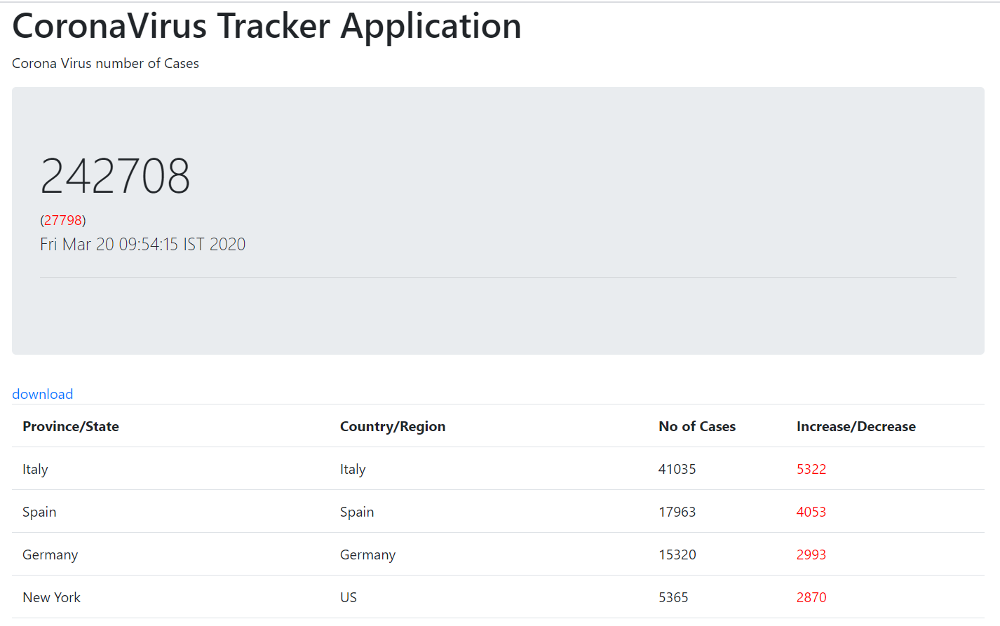

# coronavirus-stats

Collects every data from the URL : https://data.humdata.org/dataset/novel-coronavirus-2019-ncov-cases

Use Spring boots web and scheduler to collect the metric every hr

```
installation instructions 
git clone https://github.com/NarendranathPanda/coronavirus-stats.git
cd  coronavirus-stats
mvn clean install
mvn spring-boot:run
```
output at http://localhost:8080


